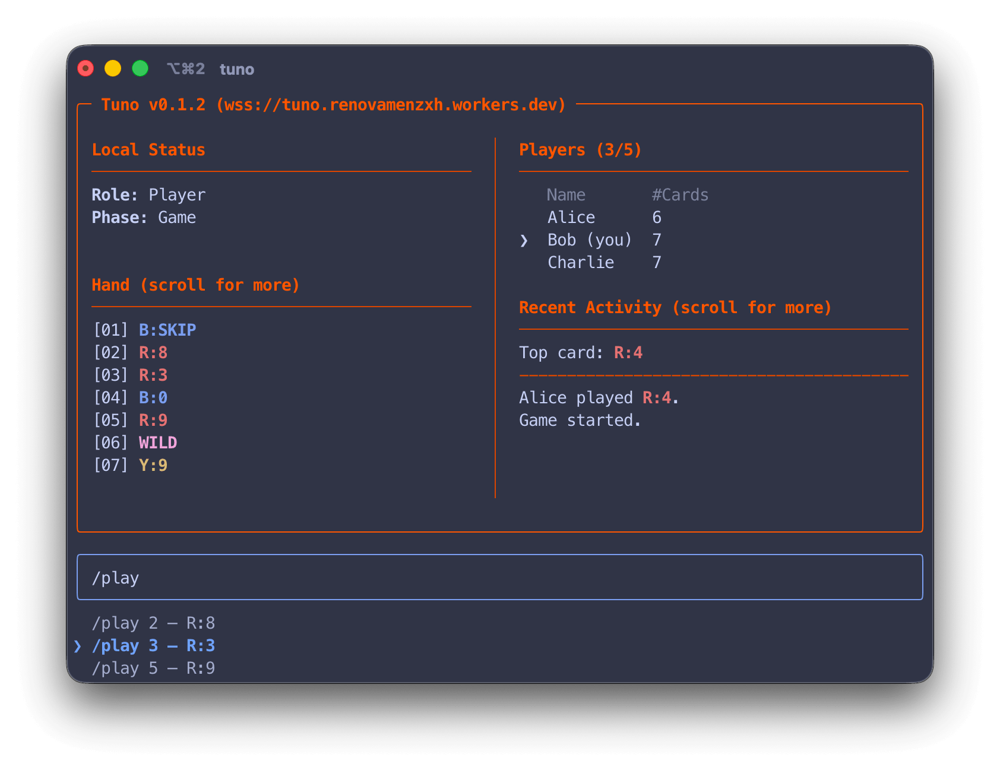

# Tuno

A terminal-first UNO game.



## Client 

### macOS / Linux

#### Install

```bash
curl -fsSL https://raw.githubusercontent.com/Renovamen/tuno/HEAD/scripts/install.sh | sh
```

The install script puts `tuno` in `~/.local/bin`. If it's not on your `PATH`, add it:

```bash
export PATH="$HOME/.local/bin:$PATH"
```

<details>
<summary>Make the change permanent</summary>

```bash
# For zsh
echo 'export PATH="$HOME/.local/bin:$PATH"' >> ~/.zshrc
source ~/.zshrc

# For bash
echo 'export PATH="$HOME/.local/bin:$PATH"' >> ~/.bashrc
source ~/.bashrc
```
</details>

#### Uninstall:

```bash
rm -rf ~/.local/share/tuno ~/.local/bin/tuno
```

## Server: Deploy on Cloudflare Workers

**Option 1:** Install [uv](https://docs.astral.sh/uv/#installation), then deploy from a local checkout:

```bash
git clone https://github.com/Renovamen/tuno.git
cd tuno
uv run pywrangler deploy
```

**Option 2:** Fork this repo and import the fork into your
[Cloudflare dashboard](https://developers.cloudflare.com/workers/get-started/dashboard/).

## How to play

After deployment, connect the client to the Worker URL:

```bash
tuno wss://<your-worker>.<subdomain>.workers.dev
```

Here is a hosted server to try:

```bash
tuno wss://tuno.renovamenzxh.workers.dev
```

### Commands

- `/connect <name>`: Join the server.
- `/start`: Host starts the round.
- `/play <n>`: Play the numbered card shown in your hand.
- `/play <n> [color]`: Play a wild card and choose its color.
- `/draw`: Draw one card.
- `/pass`: Pass after drawing, when allowed.
- `/uno`: Arm UNO for your next play.
- `/exit`: Quit.

Type `Tab` to autocomplete the current command.

### Notable rules

- The first player is the host.
- The host can start once at least 2 players have joined.
- Arm UNO with `/uno` **before** playing a card from a two-card hand. Missing UNO triggers an immediate 2-card penalty.
- A drawn card is immediately playable if it is valid.
- `Wild +4` is rejected if the player still has a non-wild card matching the current color.

## Todo

- [ ] Multiple game rooms
- [ ] House rules
- [ ] More players
- [ ] Chat

## Development

Check [DEVELOP.md](DEVELOP.md) for development instructions.
